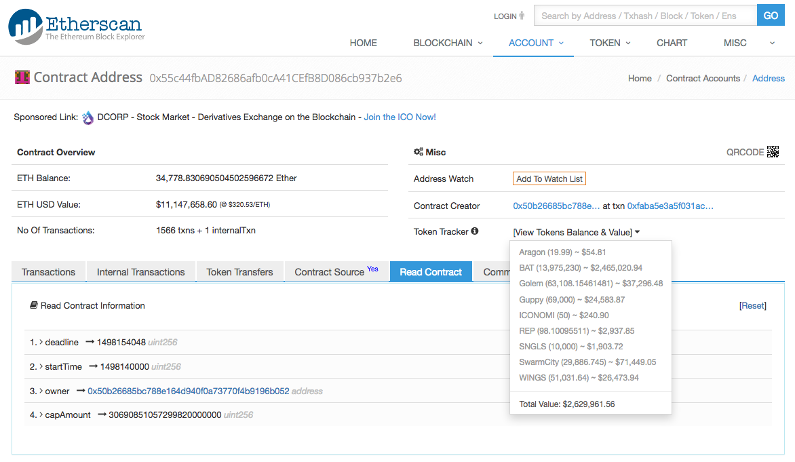

# FunFair Crowdsale Contract Audit

**Report status: Work in progress. The smart contract code has some minor issues. Further testing is being conducted to confirm that there are no other side effects.**

Bok Consulting Pty Ltd was requested to audit the smart contracts for the upcoming [FunFair](https://www.funfair.io/) [Token Presale](https://www.funfair.io/token-event/) contracts within a day of the crowdsale.

The smart contracts covered in this audit in the original request are:

* [FunFairSale](contracts/FunFairSale.sol#L47) at [0x5c84c9dd997e16578e62c9f7557e708db05c1076](https://etherscan.io/address/0x5c84c9dd997e16578e62c9f7557e708db05c1076#code) with current settings:
  * `saleTime`: `1209600`
  * `deadline`: `1499436000` "Fri, 07 Jul 2017 14:00:00 UTC"
  * `startTime`: `1498140000` "Thu, 22 Jun 2017 14:00:00 UTC"
  * `owner`: [`0x18250eaf72bbaa0237a662b9b85ebd8fa0cf128f`](https://etherscan.io/address/0x18250eaf72bbaa0237a662b9b85ebd8fa0cf128f)
  * `capAmount`: `0`
* [Token](contracts/TokenControllerAndLedger.sol#L89) at [0xc69071e982fb7bc136accc86169da8dbdf705220](https://etherscan.io/address/0xc69071e982fb7bc136accc86169da8dbdf705220#code) with current settings:
  * `name`: `FunFair`
  * `totalSupply`: `0`
  * `decimals`: `8`
  * `owner`: [`0x18250eaf72bbaa0237a662b9b85ebd8fa0cf128f`](https://etherscan.io/address/0x18250eaf72bbaa0237a662b9b85ebd8fa0cf128f)
  * `symbol`: `FUN`
  * `finalized`: `False`
* [Controller](contracts/TokenControllerAndLedger.sol#L171) at [0xc9b3378516d0c7a622ff325dd3dfd60b50f7a74c](https://etherscan.io/address/0xc9b3378516d0c7a622ff325dd3dfd60b50f7a74c#code) with current settings:
  * `totalSupply`: `0`
  * `ledger`: [`0x29b77fa51f36991f99bbeb702471b7227510d05a`](https://etherscan.io/address/0x29b77fa51f36991f99bbeb702471b7227510d05a)
  * `owner`: [`0x18250eaf72bbaa0237a662b9b85ebd8fa0cf128f`](https://etherscan.io/address/0x18250eaf72bbaa0237a662b9b85ebd8fa0cf128f)
  * `finalized`: `False`
  * `token`: [`0xc69071e982fb7bc136accc86169da8dbdf705220`](https://etherscan.io/address/0xc69071e982fb7bc136accc86169da8dbdf705220)
* [Ledger](contracts/TokenControllerAndLedger.sol#L232) at [0x29b77fa51f36991f99bbeb702471b7227510d05a](https://etherscan.io/address/0x29b77fa51f36991f99bbeb702471b7227510d05a#code) with current settings:
  * `totalSupply`: `0`
  * `owner`: [`0x18250eaf72bbaa0237a662b9b85ebd8fa0cf128f`](https://etherscan.io/address/0x18250eaf72bbaa0237a662b9b85ebd8fa0cf128f)
  * `finalized`: `False`
  * `controller`: [`0xc9b3378516d0c7a622ff325dd3dfd60b50f7a74c`](https://etherscan.io/address/0xc9b3378516d0c7a622ff325dd3dfd60b50f7a74c)

<br />

## Live Crowdsale Contract

As listed on FunFair's website, new version of [FunFairSale](contracts/FunFairSale-new.sol) has been published at [0x55c44fbad82686afb0ca41cefb8d086cb937b2e6](https://etherscan.io/address/0x55c44fbad82686afb0ca41cefb8d086cb937b2e6#code) with current settings:

  * `saleTime`: `1209600`
  * `deadline`: `1498154048` "Thu, 22 Jun 2017 17:54:08 UTC"
  * `startTime`: `1498140000` "Thu, 22 Jun 2017 14:00:00 UTC"
  * `owner`: [`0x18250eaf72bbaa0237a662b9b85ebd8fa0cf128f`](https://etherscan.io/address/0x18250eaf72bbaa0237a662b9b85ebd8fa0cf128f)
  * `capAmount`: `30690851057299820000000` (30690.85105729982 ETH)

This contract address has been published on FunFair's [Slack](https://funfair.slack.com/) as the crowdfunding contract.

The differences between these two contracts follow:

```javascript
$ diff -b FunFairSale-new.sol FunFairSale.sol 
8d7
< 
49,50c48,50
<     uint public deadline = 1499436000;
<     uint public startTime = 1498140000;
---
>     uint public deadline;
>     uint public startTime = 123123; //set actual time here
>     uint public saleTime = 14 days;
53c53,55
<     function FunFairSale() {}
---
>     function FunFairSale() {
>         deadline = startTime + saleTime;
>     }
60a63,64
>         // cap is immutable once the sale starts
>         if (this.balance > 0) throw;
66,68c70,72
< 
<         if (this.balance > capAmount) {
<             deadline = block.timestamp - 1;
---
>         if (this.balance >= capAmount) throw;
>         if (this.balance + msg.value >= capAmount) {
>             deadline = block.timestamp;
74,76d77
< 
<         //testing return value doesn't do anything here
<         //but it stops a compiler warning
79a81
>     // for testing
81c83
<         if (block.timestamp >= startTime) throw;
---
>       if (_deadline < _startTime) throw;
```

As of Fri, 23 Jun 2017 00:59:30 UTC, the following funds were raised at this contract address:

* 34,778.830690504502596672 Ether ~ $11,147,658.60 @ $320.53/ETH
* 19.99 Aragon ~ $54.81
* 13,975,230 BAT ~ $2,465,020.84
* 63,108.15461481 Golem ~ $37,296.46
* 69,000 Guppy ~ $24,583.87
* 50 ICONOMI ~ $240.90
* 98.10095511 REP ~ $2,937.85
* 10,000 SNGLS ~ $1,903.72
* 29,886.745 SwarmCity ~ $71,449.05
* 51,031.64 WINGS ~ $26,473.94



<br />

## Live Token Contract

As discussed on [https://funfair.slack.com](https://funfair.slack.com), the same version of the [Token](contracts/TokenControllerAndLedger.sol#L89) contract has been published at [0xBbB1BD2D741F05E144E6C4517676a15554fD4B8D](https://etherscan.io/address/0xBbB1BD2D741F05E144E6C4517676a15554fD4B8D) with current settings:

  * `name`: `FunFair`
  * `totalSupply`: `1588932231060000000` (15889322310.6 FUN)
  * `decimals`: `8`
  * `owner`: [`0x50b26685bc788e164d940f0a73770f4b9196b052`](https://etherscan.io/address/0x50b26685bc788e164d940f0a73770f4b9196b052)
  * `symbol`: `FUN`
  * `finalized`: `False`

<br />

## Update Jun 29 2017

This audit is referenced in [FunFair Token Contract Audit](https://funfair.io/wp-content/uploads/2017/06/FunFair-Token-Contract-Audit.pdf) by Peter Vessenes.

<br />

<hr />

# Table of contents

* [Terminology](#terminology)
  * [Likelihood](#likelihood)
  * [Impact](#impact)
  * [Severity](#severity)
* [Findings](#findings)
  * [1. Severe Security Flaws](#1-severe-security-flaws)
  * [2. Architecture And Design Choices](#2-architecture-and-design-choices)
    * [2.1 Double Declaration Of `Token.owner`](#21-double-declaration-of-tokenowner)
    * [2.2 `FunFairSale.setStartTime(...)` Allows The Crowdsale Parameters To Be Modified](#22-funfairsalesetstarttime-allows-the-crowdsale-parameters-to-be-modified)
    * [2.3 `FunFairSale.()` Double Counts `msg.value`](#23-funfairsale-double-counts-msgvalue)
  * [3. Use Of Best Practices](#3-use-of-best-practices)
    * [3.1 Replace `owner.call.value(...)()` With `owner.transfer(...)`](#31-replace-ownercallvalue-with-ownertransfer)
    * [3.2 Recent Solidity Version](#32-recent-solidity-version)
  * [4. Comments And Suggestions](#4-comments-and-suggestions)
  * [5. Additional Information And Notes](#5-additional-information-and-notes)
  * [6. Tests](#6-tests)
  * [7. References](#7-references)
  * [8. Conclusion](#8-conclusion)

<br />

<hr />

# Terminology

This audit uses the following terminonology. Note that we only rank the likelihood, impact and severity for bug and/or security related issues.

## Likelihood

How likely a bug is to be encountered or exploited when deployed in practice, as specified by the [OWASP Risk Rating Methodology](https://www.owasp.org/index.php/OWASP_Risk_Rating_Methodology#The_OWASP_Risk_Rating_Methodology).

## Impact

The impact a bug would have if exploited, as specified by the [OWASP Risk Rating Methodology](https://www.owasp.org/index.php/OWASP_Risk_Rating_Methodology#The_OWASP_Risk_Rating_Methodology).

## Severity

How serious the issue is, derived from Likelihood and Impact as specified by the [OWASP Risk Rating Methodology](https://www.owasp.org/index.php/OWASP_Risk_Rating_Methodology#The_OWASP_Risk_Rating_Methodology).

<br />

<hr />

# Findings

Below is our audit results and recommendations, listed in order of importance:

## 1. Severe Security Flaws

From the preliminary results, there are no severe security issues in the FunFairSale contract. The token contracts are currently being tested.

<br />

## 2. Architecture And Design Choices

### 2.1 Bug - Double Declaration Of `Token.owner`

Likelihood: `Low`

Impact: `Low`

`owner` is declared in the [`Token` contract](contracts/TokenControllerAndLedger.sol#L96), and is also inherited through the [`Finalizable` contract](contracts/TokenControllerAndLedger.sol#L89) that inherits [`owner`](contracts/TokenControllerAndLedger.sol#L28) in the [`Owned`](contracts/TokenControllerAndLedger.sol#L52) class.

The side effects is unknown, but an example of this occurred with the double declaration of `totalSupply` in the [RAREPeperiumToken](https://github.com/bokkypoobah/RAREPeperiumToken) resulting in `totalSupply` being reported as `115792089237316195423570985008687907853269984665640564039457583907913129639936` as can be seen the [Total Supply](https://ethplorer.io/address/0x584aa8297edfcb7d8853a426bb0f5252c4af9437#pageSize=100) field.

In this contract, it seems that `Token.owner` is never used, so there may be no side effects from this double declaration.

Deploying the following code in [Remix](http://remix.ethereum.org) will result in the variable `owned` being set to a value like `0x000000000000000000000000ca35b7d915458ef540ade6068dfe2f44e8fa733c`, and function `getOwned()` returning `0x0000000000000000000000000000000000000000000000000000000000000000`:

```javascript
pragma solidity ^0.4.11;

contract Owned {
    address public owned;
    
    function Owned() {
        owned = msg.sender;
    }
}

contract Test is Owned {
    address owned;

    function getOwned() constant returns (address){
        return owned;
    }
}
```

<br />

### 2.2 `FunFairSale.setStartTime(...)` Allows The Crowdsale Parameters To Be Modified

The `FunFairSale.setStartTime(...)` with the comment `// for testing` allows the contract owner to set the `startTime` and `deadline` variables to any arbitrary time, as long as `deadline` is after `startTime`.

This will allow the owner to set the `deadline` to a time prior to `now`, allowing the owner to withdraw all held funds from this contract.

If the contract balance is zero, the owner is able to execute the `launch(...)` function that will enable the owner to set `capAmount` to a new cap.

<br />

### 2.3 `FunFairSale.()` Double Counts `msg.value`

`msg.value` is included in `this.balance` in the [comparison](contracts/FunFairSale.sol#L71) `if (this.balance + msg.value >= capAmount) {` and will result in the cap be triggered by the total contributions being below the desired cap value.

Deploying the following code in [Remix](http://remix.ethereum.org), setting **Value** to `10` and executing **test** will result in the variable `thebalance` to be set to `20` as `this.balance` includes the ethers sent in `msg.value`:

```javascript
pragma solidity ^0.4.11;

contract Test {
    uint public thebalance;

    function test() payable {
        thebalance = this.balance + msg.value;
    }
}
```

<br />

## 3. Use Of Best Practices

### 3.1 Replace `owner.call.value(...)()` With `owner.transfer(...)`

The `owner.call.value(...)` external call provides the destination address with sufficient gas to [trigger code execution](https://github.com/ConsenSys/smart-contract-best-practices#be-aware-of-the-tradeoffs-between-send-transfer-and-callvalue) and should be replaced with `owner.transfer(...)`. In this case, the destination address is under the control of the contract owner so the likelihood of this call being exploited is low. 

<br />

### 3.2 Recent Solidity Version

The statement `pragma ^0.4.4` in the source code should be updated to `pragma ^4.1.11` so the latest stable compiler with [recent bug fixes](https://github.com/ethereum/solidity/blob/develop/docs/bugs_by_version.json) is checked for before deployment. The deployed contracts have all been compiled with Solidity `v0.4.11+commit.68ef5810`, so there is no impact from the use of `pragma ^0.4.4` in the source code anyway. 

<br />

## 4. Comments And Suggestions


<br />

## 5. Additional Information And Notes

Further comments on the code can be found in [FunFairSale.md](FunFairSale.md) and [TokenControllerLedger.md](TokenControllerLedger.md).

<br />

## 6. Tests

See [test/README.md](test/README.md) for details on the testing of these contracts.

<br />

## 7. References

* [Ethereum Contract Security Techniques and Tips](https://github.com/ConsenSys/smart-contract-best-practices)
* [ERC: Token Standard #20](https://github.com/ethereum/EIPs/issues/20)

<br />

## 8. Conclusion

From the preliminary results, there are no severe security issues in the FunFairSale contract. The token contracts are currently being tested.

The `FunFairSale.setStartTime(...)` function should be removed as this removes the need for presale participants to trust the contract owner not to manipulate the token presale contract parameters.

There is the double counting of the `msg.value` in the `capAmount` check, and this will bring forward the sale end date/time prematurely. In the live contract, this bug will not apply as the cap 

<br />

<hr />

<br />

Enjoy. (c) BokkyPooBah / Bok Consulting Pty Ltd for FunFair 2017. The MIT Licence.
